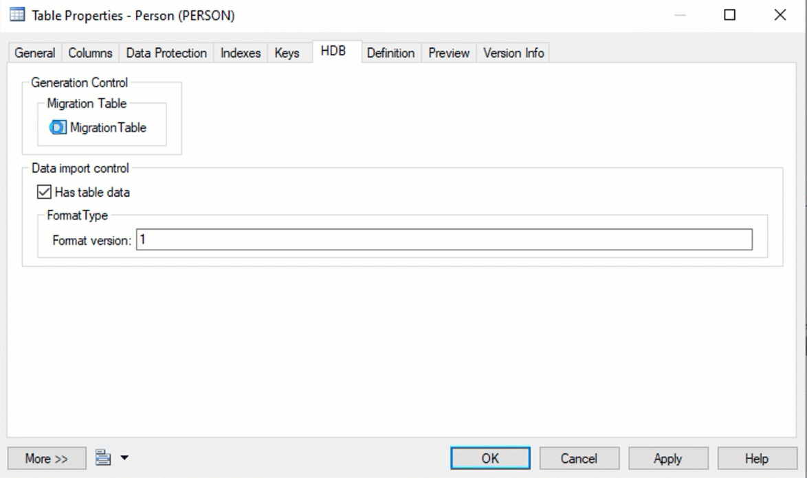

# Extension "HDBTABLE" for PD using HANA2 datamodel

## Allow PD model to generate 
- HDBTABLE
- HDBMIGRATIONTABLE
- HDBTABLEDATA

Functions that are not implemented
- Primary key keytype  -> is blank and leave HANA use default
- HDBCONTRAINTS        -> no FK building 

### Usage
- if you use migrationtable you can add migration steps as a propertie of the table
- add new version have to have a higher numbers
- the number have to be maintained by hand
- do not change the sequence of the versions !

### Known Issues
- HDBTABLEDATA is intended for application logic not for customer data and are used typical in an HDBTABLE construct ( no need for migration efforts )

- In the compare dialog of PowerDesigenr you have to deselect the migration objects from the comparism. Otherwise the difference is not properly build
- You can swap between hdbtable and hdbmigrationtable. However you have to manual delete the old type. The HDI deployer will otherwise indicate an error.

## Steps to get the system working.
- attach the HDB Table.xem to the model. Now you have the hdbtable generator enable. On each table you should have the HDB tab.

## The extension adds some options to the TABLE object in PD 
## Overview of user interface on the "Table" properties
You can choose: 
-  <B>HDBTABLE (DEFALUT)</B> or 
-  <B>HDBMIGRATIONTABLE</B>
#### HDBMIGRATIONTABLE need more information so 2 addtional tabs are visible with this option.
#### HDBMigrationtable with 
- Version number and
- HDB-DEV Table (optional) for later usage
#### Migration
- this will later have all the migration history to move from version 1 to version 2 and so on. The number of last migration is the current version

## Steps to get the first mirgration:
## Build a second version of our model
- To show the function we need to have 2 versions of a datamodel. 
- In this demo this is achieved by using the repository and a branching
- PowerDesigner has also other possibilies but this one was choosen
    - Check into repo

## Build a branch
- by this we have 2 version of the same model 

## Check out the model in the branch
   - By remanaming the "version text" we are sure to be on the right version 

## Build our first extended Generation for HDI artifacts 
This will have 
- HDTABLE
- HDBMIGRATIONTABLE
- HDBTABLEDATA (if you want to add data to the table)
    - Careful if you switch between HDBTABLE and HDBMIGRATION table. Since there is clean up yet in the tool you have to make sure there in ONE HDB artifact in the result. You MUST delete the other one!. Otherwise the HDI deployer will produce errors. You can switch but you have to be carefull.
    - This you can push now to GIT or import into BAS or WEBIDE to deploy to HANA

## Modifing the contend to force the generation of change scripts

## Generating the alter statement in PowerDesigner
 - Be sure to deselect the "MIGRATION" object of PowerDesigner. Otherwise the result will be wrong
 - This selections is stored in the model, so it is only the first time you have to do so

## Generate the migration script and copy it into the migration section of the table
 - This is currently a manual step per table
 - We are looking to make this more handsome

## Generate the HDI artifacts 
-  Extended generation
-  Clean up if there are 2 different articats for the same table
- Push to git of import in BAS/WebIDE

-

## Now you have build you first migration script

